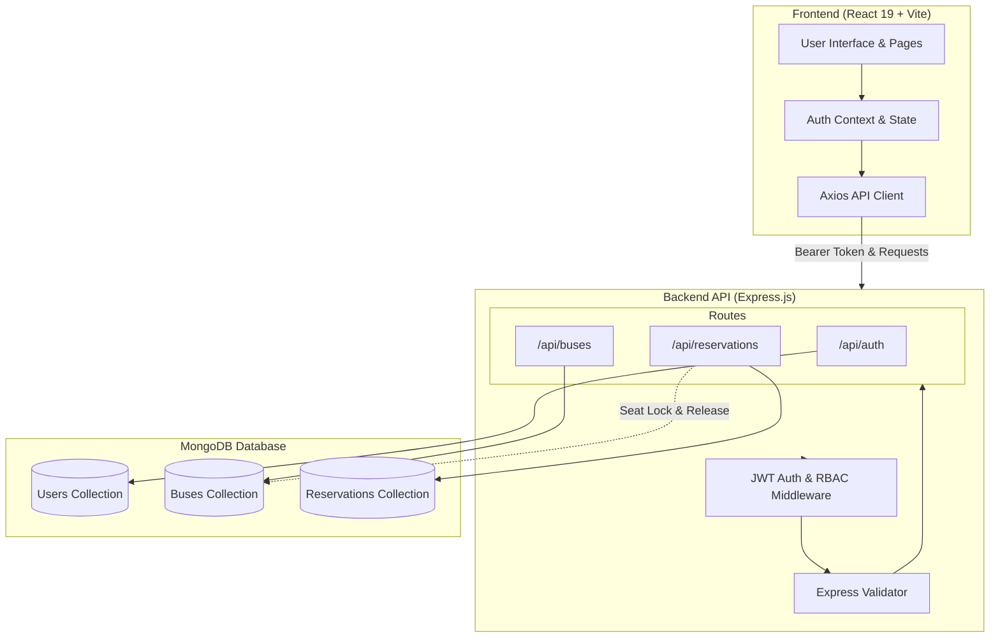

# 🚌 RideSmart — Bus Management & Ticket Booking System

[](https://nodejs.org/)
[](https://expressjs.com/)
[](https://react.dev/)
[](https://vitejs.dev/)
[](https://www.mongodb.com/)
[](https://jwt.io/)

**RideSmart** is a modern, full-stack bus ticket reservation and fleet management web application built with the **MERN** stack (MongoDB, Express, React, Node.js) and powered by Vite. It provides an intuitive interface for passengers to discover routes, choose visual seats, and book tickets, alongside a role-protected management portal for administrators and operators to manage bus schedules and inventory.

---

## 📑 Table of Contents

- [Key Features](#-key-features)
- [System Architecture](#-system-architecture)
- [Tech Stack](#-tech-stack)
- [Project Structure](#-project-structure)
- [Getting Started](#-getting-started)
  - [Prerequisites](#prerequisites)
  - [Backend Setup](#1-backend-setup)
  - [Frontend Setup](#2-frontend-setup)
  - [Database Seeding](#3-database-seeding-optional)
- [Environment Variables](#-environment-variables)
- [API Reference](#-api-reference)
  - [Authentication](#authentication-routes)
  - [Bus Schedule Management](#bus-routes)
  - [Reservations & Booking](#reservation-routes)
- [User Roles & Permissions](#-user-roles--permissions)
- [Database Schema Design](#-database-schema-design)
- [Scripts Reference](#-scripts-reference)
- [License](#-license)

---

## ✨ Key Features

### 👤 Passenger Features
- **User Authentication & Profiles**: Secure sign-up/login with JWT, bcrypt password hashing, and user profile & password management.
- **Dynamic Bus Search**: Search buses by origin, destination, and travel date with instant schedule results.
- **Advanced Filtering & Sorting**: Filter by coach type (`AC` / `Non-AC`), maximum fare range, and sort by price, departure time, or recommendations.
- **Interactive Visual Seat Selection**: Real-time interactive seat layout grid with driver cabin view, aisle separation, and seat states (*Available*, *Selected*, *Booked*).
- **Seat Booking Limits**: Configurable seat limit (up to 4 seats per booking) with live price breakdown.
- **Instant E-Tickets & PNR Generation**: Booking confirmation with passenger details, departure summary, and ticket records with immutable schedule snapshots.
- **Reservation Management**: Track active and past bookings under "My Bookings" with one-click reservation cancellation and automatic seat release.

### 🛠️ Admin & Manager Features
- **Fleet & Schedule Management**: Full CRUD capabilities for bus schedules (add new buses, edit routes/timings/pricing, cancel or remove trips).
- **Live Capacity Tracking**: Monitor total capacity, booked seats, and remaining seats per bus.
- **Role-Based Access Control (RBAC)**: Backend and frontend route protection restricting fleet management access to `admin` and `manager` roles.
- **Admin Promotion CLI**: Built-in CLI utility to promote registered users to `admin`, `manager`, or `driver`.

---

## 🏛️ System Architecture



---

## 🛠️ Tech Stack

### Frontend
- **Framework**: [React 19](https://react.dev/) + [Vite 8](https://vitejs.dev/)
- **Routing**: [React Router v7](https://reactrouter.com/)
- **State Management**: React Context API (`AuthContext`)
- **HTTP Client**: [Axios](https://axios-http.com/) with request interceptors for JWT token injection
- **Notifications**: [React Hot Toast](https://react-hot-toast.com/)
- **Styling**: Modern CSS3 with custom variables, smooth transitions, responsive grids, and glassmorphic elements

### Backend
- **Runtime**: [Node.js](https://nodejs.org/) (ES6+ / CommonJS)
- **Framework**: [Express.js 4](https://expressjs.com/)
- **Database**: [MongoDB](https://www.mongodb.com/) via [Mongoose 8 ODM](https://mongoosejs.com/)
- **Authentication**: [JSON Web Tokens (JWT)](https://jwt.io/) & [Bcrypt.js](https://www.npmjs.com/package/bcryptjs)
- **Validation**: [express-validator 7](https://express-validator.github.io/)
- **CORS**: Configurable cross-origin resource sharing

---

## 📂 Project Structure

```
bus_management/
├── backend/
│   ├── config/
│   │   └── db.js                 # MongoDB connection logic
│   ├── middleware/
│   │   └── auth.js               # JWT auth & role authorization middleware
│   ├── models/
│   │   ├── Bus.js                # Bus route & seat inventory model
│   │   ├── Reservation.js        # Ticket booking & snapshot model
│   │   └── User.js               # User account & credential schema
│   ├── routes/
│   │   ├── auth.js               # Auth, registration, and profile endpoints
│   │   ├── buses.js              # Bus query & management endpoints
│   │   └── reservations.js       # Booking and cancellation endpoints
│   ├── seed/
│   │   ├── promoteUser.js        # CLI utility to elevate user roles
│   │   └── seedBuses.js          # Pre-populated routes & schedules generator
│   ├── .env                      # Backend environment variables
│   ├── package.json              # Backend dependencies and scripts
│   └── server.js                 # Server entry point & middleware mounting
│
└── frontend/
    ├── public/                   # Static public assets
    ├── src/
    │   ├── components/
    │   │   ├── common/           # Reusable UI widgets (cards, badges, modals)
    │   │   ├── layout/           # Navbar, Footer, and app layout wrappers
    │   │   ├── BookingConfirmation.jsx # Booking review & passenger details
    │   │   ├── BusManagement.jsx # Admin/Manager schedule dashboard
    │   │   ├── Dashboard.jsx     # User dashboard & overview
    │   │   ├── Login.jsx         # Sign in page
    │   │   ├── MyBookings.jsx    # Booking history & ticket viewer
    │   │   ├── Profile.jsx       # Profile details & password reset
    │   │   ├── Register.jsx      # Sign up page
    │   │   ├── SearchBus.jsx     # Route search, filters & bus listing
    │   │   └── SeatSelection.jsx # Visual interactive seat layout selector
    │   ├── context/
    │   │   └── AuthContext.jsx   # Authentication context & auth persistence
    │   ├── services/
    │   │   └── api.js            # Axios client setup with interceptors
    │   ├── styles/               # Component & global style definitions
    │   ├── App.jsx               # Route definitions & protected routes
    │   └── main.jsx              # React app mount
    ├── .env                      # Frontend environment variables
    ├── index.html                # HTML entry point
    ├── package.json              # Frontend dependencies and scripts
    └── vite.config.js            # Vite configuration
```

---

## 🚀 Getting Started

### Prerequisites
Make sure you have the following installed on your machine:
- [Node.js](https://nodejs.org/) (v18.0.0 or higher recommended)
- [npm](https://www.npmjs.com/) (v9+) or [yarn](https://yarnpkg.com/)
- [MongoDB](https://www.mongodb.com/) running locally on port `27017` or a [MongoDB Atlas](https://www.mongodb.com/cloud/atlas) cluster URI

---

### 1. Backend Setup

1. Open a terminal and navigate to the `backend` directory:
   ```bash
   cd backend
   ```

2. Install dependencies:
   ```bash
   npm install
   ```

3. Configure your `.env` file inside `backend/` (refer to [Environment Variables](#-environment-variables)):
   ```env
   PORT=5001
   MONGO_URI=mongodb://localhost:27017/bus_management
   JWT_SECRET=your_super_secret_jwt_key_change_in_production
   JWT_EXPIRE=7d
   CLIENT_URL=http://localhost:5173
   ```

4. Start the backend development server:
   ```bash
   npm run dev
   ```
   > The API will be live at `http://localhost:5001` (or your configured `PORT`).

---

### 2. Frontend Setup

1. Open a new terminal and navigate to the `frontend` directory:
   ```bash
   cd frontend
   ```

2. Install dependencies:
   ```bash
   npm install
   ```

3. Configure your `.env` file inside `frontend/`:
   ```env
   VITE_API_URL=http://localhost:5001/api
   ```

4. Start the Vite development server:
   ```bash
   npm run dev
   ```
   > The application will open at `http://localhost:5173`.

---

### 3. Database Seeding (Optional)

To populate the database with realistic bus routes, timings, and fares across major intercity routes (e.g., Dhaka ↔ Rajshahi, Chittagong, Sylhet, Khulna, Barisal):

```bash
cd backend
# Seed only if database is empty:
npm run seed

# Force re-seed (clears existing buses and creates fresh schedules with rolling dates):
npm run seed -- --force
```

To promote any registered user to **admin** or **manager**:
```bash
npm run promote user@example.com admin
```

---

## 🔐 Environment Variables

### Backend (`backend/.env`)

| Variable | Description | Default / Example |
| :--- | :--- | :--- |
| `PORT` | Server listening port | `5001` |
| `MONGO_URI` | MongoDB connection URI | `mongodb://localhost:27017/bus_management` |
| `JWT_SECRET` | Secret key used for signing JWT tokens | `your_secret_key` |
| `JWT_EXPIRE` | Expiry duration for auth tokens | `7d` |
| `CLIENT_URL` | Frontend origin for CORS policy | `http://localhost:5173` |

### Frontend (`frontend/.env`)

| Variable | Description | Default / Example |
| :--- | :--- | :--- |
| `VITE_API_URL` | Base endpoint for the Backend API | `http://localhost:5001/api` |

---

## 📡 API Reference

### Authentication Routes
Base URL: `/api/auth`

| Method | Endpoint | Access | Description |
| :--- | :--- | :--- | :--- |
| `POST` | `/register` | Public | Register a new account (`firstName`, `lastName`, `email`, `password`, `phone`) |
| `POST` | `/login` | Public | Authenticate user credentials and return JWT token |
| `GET` | `/me` | Private | Retrieve current authenticated user profile |
| `PUT` | `/profile` | Private | Update current user's profile details |
| `PUT` | `/change-password` | Private | Change account password (requires `currentPassword` & `newPassword`) |

---

### Bus Routes
Base URL: `/api/buses`

| Method | Endpoint | Access | Description |
| :--- | :--- | :--- | :--- |
| `GET` | `/search` | Private | Search scheduled buses (`source`, `destination`, `date`, `coachType`, `maxFare`, `sort`) |
| `GET` | `/` | Admin/Manager | List all buses with pagination, search, and status filters |
| `GET` | `/:id` | Private | Get detailed information and booked seats for a specific bus |
| `POST` | `/` | Admin/Manager | Create a new bus schedule |
| `PUT` | `/:id` | Admin/Manager | Update existing bus details and status |
| `DELETE` | `/:id` | Admin/Manager | Delete a bus record |

---

### Reservation Routes
Base URL: `/api/reservations`

| Method | Endpoint | Access | Description |
| :--- | :--- | :--- | :--- |
| `POST` | `/` | Private | Create a seat reservation (`busId`, `seats[]`, `passengerName`, `passengerPhone`, `passengerEmail`) |
| `GET` | `/my` | Private | Retrieve all reservations made by the logged-in user |
| `GET` | `/:id` | Private | Get single reservation details and ticket snapshot |
| `PUT` | `/:id/cancel` | Private | Cancel a confirmed reservation and release booked seats back to inventory |

---

## 👥 User Roles & Permissions

| Feature / Capability | User (`user`) | Driver (`driver`) | Manager (`manager`) | Admin (`admin`) |
| :--- | :---: | :---: | :---: | :---: |
| Search Routes & View Schedules | ✅ | ✅ | ✅ | ✅ |
| Visual Seat Selection & Booking | ✅ | ✅ | ✅ | ✅ |
| View & Cancel Personal Bookings | ✅ | ✅ | ✅ | ✅ |
| Update Personal Profile & Password | ✅ | ✅ | ✅ | ✅ |
| Access Fleet Management Portal | ❌ | ❌ | ✅ | ✅ |
| Create & Edit Bus Schedules | ❌ | ❌ | ✅ | ✅ |
| Delete Bus Schedules | ❌ | ❌ | ✅ | ✅ |
| Promote User Roles via CLI | ❌ | ❌ | ❌ | ✅ |

---

## 🗄️ Database Schema Design

### `User` Schema
- `firstName`: String (Required, max 50 chars)
- `lastName`: String (Required, max 50 chars)
- `email`: String (Required, unique, validated email format)
- `password`: String (Required, hashed with bcrypt salt 12)
- `phone`: String (Optional)
- `role`: Enum (`'user'`, `'admin'`, `'manager'`, `'driver'`; default: `'user'`)
- `timestamps`: Automatic `createdAt` and `updatedAt`

### `Bus` Schema
- `operator`: String (Required, e.g. "Green Line Paribahan")
- `busNumber`: String (Required, unique, uppercase)
- `coachType`: Enum (`'AC'`, `'Non-AC'`)
- `source`: String (Required)
- `destination`: String (Required)
- `journeyDate`: Date (Required)
- `departureTime`: String (24-hour format `HH:mm`)
- `arrivalTime`: String (24-hour format `HH:mm`)
- `duration`: String (e.g. "5h 30m")
- `fare`: Number (Required, minimum 0)
- `totalSeats`: Number (Required, min 1, max 100)
- `availableSeats`: Number (Tracked dynamically)
- `bookedSeats`: Array of seat numbers `[Number]`
- `status`: Enum (`'scheduled'`, `'cancelled'`, `'completed'`)
- `createdBy`: ObjectId reference to `User`

### `Reservation` Schema
- `bus`: ObjectId reference to `Bus`
- `user`: ObjectId reference to `User`
- `seats`: Array of seat numbers `[Number]` (1 to 4 seats)
- `passengerName`: String (Required)
- `passengerPhone`: String (Required)
- `passengerEmail`: String (Optional)
- `totalFare`: Number (Calculated as `seats.length * fare`)
- `status`: Enum (`'confirmed'`, `'cancelled'`)
- `busSnapshot`: Object storing immutable trip details at time of reservation
- `timestamps`: Automatic `createdAt` and `updatedAt`

---

## 📜 Scripts Reference

### Backend Scripts (`/backend`)
- `npm start`: Starts server in production mode using `node server.js`.
- `npm run dev`: Starts server in development mode with live reload using `nodemon`.
- `npm run seed`: Seeds mock bus routes (skips if collection is not empty).
- `npm run seed -- --force`: Wipes bus collection and reseeds fresh data with rolling dates.
- `npm run promote <email> <role>`: Updates user role in the database.

### Frontend Scripts (`/frontend`)
- `npm run dev`: Starts the Vite development server with Hot Module Replacement (HMR).
- `npm run build`: Bundles the React application for production into `dist/`.
- `npm run preview`: Locally previews the production build.
- `npm run lint`: Runs Oxlint checks across the codebase.

---

## 📄 License

This project is open source and available under the [MIT License](LICENSE).
